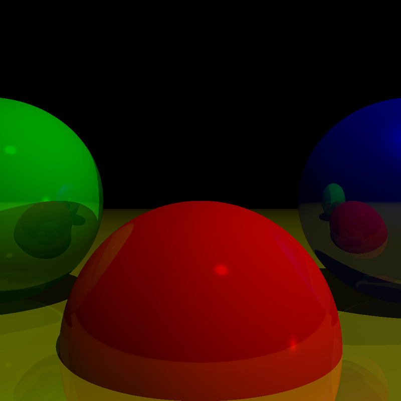

# My Journey Learning Computer Graphics

Based on **the book**
[Computer Graphics from Scratch](https://gabrielgambetta.com/computer-graphics-from-scratch/)
by Gabriel Gambetta. Written with [Rust](https://www.rust-lang.org/)
because it is factually the best programming language ;).

## Ray Tracing

Implemented:

- Sphere
- Ligting
- Shadow
- Reflection

## Razterization

TODO
